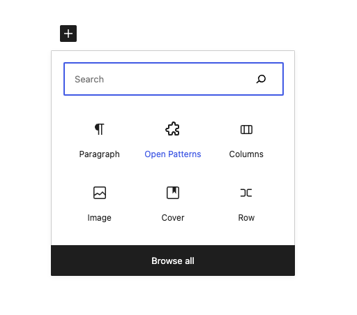
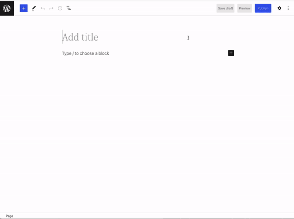

## what is it?

Opens the patterns modal when you type /patterns

## why?

I saw a [Tweet about it](https://twitter.com/ellenbauer/status/1542698832810885120) and thought it would be fun to throw together

## until when?

This plugin could very well become obsolete if similiar (and more reliable) functionality is merged into core. Because of that, this wont be published to w.org and it has auto updates disabled

## how?

Just press code button at the top of Github and then press "Download Zip." That's the file you pload to your site.

## images

